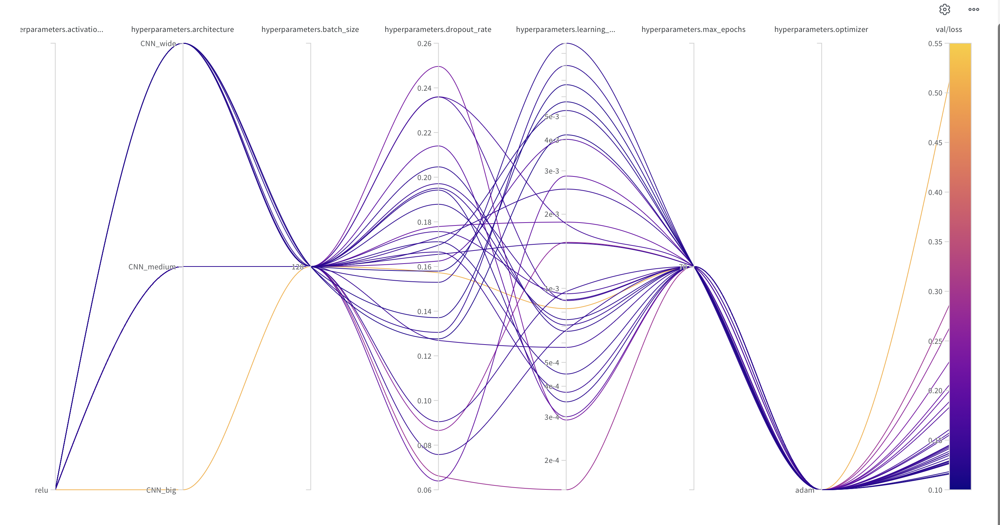
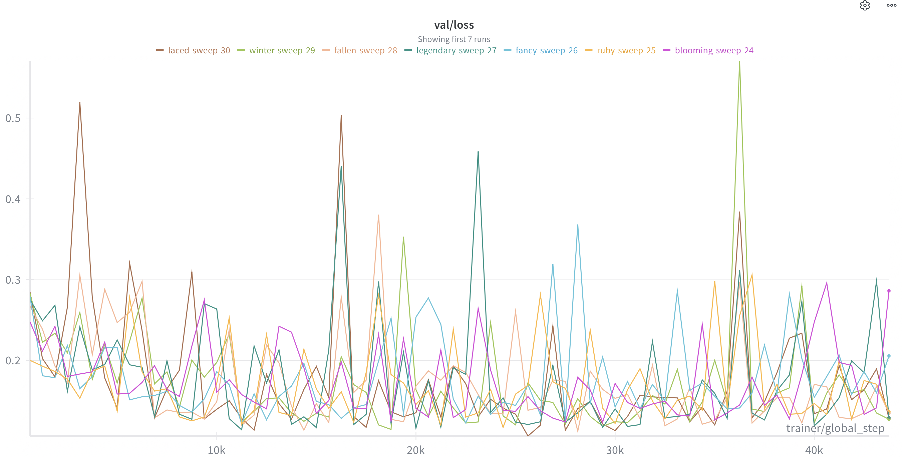

# Project Description: Cifake Classification
A reproducible cifake classification model in a MLops dynamic framework

In this project, we will try to classify AI-generated images from human-generated images in the field of art. We will be using the dataset called “CIFAKE: Real and AI-Generated Synthetic Images”. The dataset consists of the CIFAR10-dataset, a dataset consisting of 60000 coloured 32x32 images, labeled to 10 classes, and 60.000 synthetically generated images of the CIFAR10 classes. The dataset is split into 50.000 training-images and 10.000 testing-images per class. The model used for image generation was Stable Diffusion, version 1.4. Although the dataset is based on the CIFAR10 dataset, we are not interested in what the object on the image is, but whether it is real or fake. Therefore, we do not label the images to 10 different classes but rather labelled as either “REAL”- meaning human generated or “FAKE”- meaning AI-generated. The dataset has a total size of 110 MB and is publicly available on [Kaggle](https://www.kaggle.com/datasets/birdy654/cifake-real-and-ai-generated-synthetic-images?resource=download).

We intend to use convolutional neural networks (CNN), implemented through the deep-learning framework Pytorch. We use CNN’s due to their efficiency in image-classification. Furthermore, we will use both Pytorch-Lightning to eliminate the boilerplate code for training and Torchvision to transform our datasets.
We will use Weights-and-Biases to try different configurations of hyperparameters and architectures and use their built-in Bayesian Optimization option to go for the best-possible model. The results of our experiments will also be logged here.
The first few days will be spent setting up a git repository, then a reproducable virtual environment with  docker, cookiecutter and uv. Then the data-processing, the model, as well as the training and validation processes, will all be implemented with the help of debugging tools, and finally we will format everything to fit PEP8-guidelines.

Our overall goal is to train a model that outperforms random guessing. Maybe, if time permits it, we will also try to compare our final model to the VGG16- a deep convolutional neural network. Another goal for us is to gain a better understanding of the MLOPs-tools taught in the course, and to be able to build a project with perfectly reproduceable results.

## Project structure

The directory structure of the project looks like this:
```txt
├── .github/                  # Github actions and dependabot
│   ├── dependabot.yaml
│   └── workflows/
│       └── tests.yaml
├── configs/                  # Configuration files
├── data/                     # Data directory
│   ├── processed
│   └── raw
├── dockerfiles/              # Dockerfiles
│   ├── api.Dockerfile
│   └── train.Dockerfile
├── docs/                     # Documentation
│   ├── mkdocs.yml
│   └── source/
│       └── index.md
├── models/                   # Trained models
├── notebooks/                # Jupyter notebooks
├── reports/                  # Reports
│   └── figures/
├── src/                      # Source code
│   ├── project_name/
│   │   ├── __init__.py
│   │   ├── api.py
│   │   ├── data.py
│   │   ├── evaluate.py
│   │   ├── models.py
│   │   ├── train.py
│   │   └── visualize.py
└── tests/                    # Tests
│   ├── __init__.py
│   ├── test_api.py
│   ├── test_data.py
│   └── test_model.py
├── .gitignore
├── .pre-commit-config.yaml
├── LICENSE
├── pyproject.toml            # Python project file
├── README.md                 # Project README
├── requirements.txt          # Project requirements
├── requirements_dev.txt      # Development requirements
└── tasks.py                  # Project tasks
```


Created using [mlops_template](https://github.com/SkafteNicki/mlops_template),
a [cookiecutter template](https://github.com/cookiecutter/cookiecutter) for getting
started with Machine Learning Operations (MLOps).

# Exam template for 02476 Machine Learning Operations

This is the report template for the exam. Please only remove the text formatted as with three dashes in front and behind
like:

```--- question 1 fill here ---```

Where you instead should add your answers. Any other changes may have unwanted consequences when your report is
auto-generated at the end of the course. For questions where you are asked to include images, start by adding the image
to the `figures` subfolder (please only use `.png`, `.jpg` or `.jpeg`) and then add the following code in your answer:

``

In addition to this markdown file, we also provide the `report.py` script that provides two utility functions:

Running:

```bash
python report.py html
```

Will generate a `.html` page of your report. After the deadline for answering this template, we will auto-scrape
everything in this `reports` folder and then use this utility to generate a `.html` page that will be your serve
as your final hand-in.

Running

```bash
python report.py check
```

Will check your answers in this template against the constraints listed for each question e.g. is your answer too
short, too long, or have you included an image when asked. For both functions to work you mustn't rename anything.
The script has two dependencies that can be installed with

```bash
pip install typer markdown
```

## Overall project checklist

The checklist is *exhaustive* which means that it includes everything that you could do on the project included in the
curriculum in this course. Therefore, we do not expect at all that you have checked all boxes at the end of the project.
The parenthesis at the end indicates what module the bullet point is related to. Please be honest in your answers, we
will check the repositories and the code to verify your answers.

### Week 1

* [x] Create a git repository (M5)
* [x] Make sure that all team members have write access to the GitHub repository (M5)
* [x] Create a dedicated environment for you project to keep track of your packages (M2)
* [x] Create the initial file structure using cookiecutter with an appropriate template (M6)
* [x] Fill out the `data.py` file such that it downloads whatever data you need and preprocesses it (if necessary) (M6)
* [x] Add a model to `model.py` and a training procedure to `train.py` and get that running (M6)
* [x] Remember to fill out the `requirements.txt` and `requirements_dev.txt` file with whatever dependencies that you
    are using (M2+M6)
* [x] Remember to comply with good coding practices (`pep8`) while doing the project (M7)
* [t] Do a bit of code typing and remember to document essential parts of your code (M7)
* [x] Setup version control for your data or part of your data (M8)
* [x] Add command line interfaces and project commands to your code where it makes sense (M9)
* [x] Construct one or multiple docker files for your code (M10)
* [x] Build the docker files locally and make sure they work as intended (M10)
* [x] Write one or multiple configurations files for your experiments (M11)
* [x] Used Hydra to load the configurations and manage your hyperparameters (M11)
* [o] Use profiling to optimize your code (M12)
* [x] Use logging to log important events in your code (M14)
* [x] Use Weights & Biases to log training progress and other important metrics/artifacts in your code (M14)
* [x] Consider running a hyperparameter optimization sweep (M14)
* [x] Use PyTorch-lightning (if applicable) to reduce the amount of boilerplate in your code (M15)

### Week 2

* [x] Write unit tests related to the data part of your code (M16)
* [x] Write unit tests related to model construction and or model training (M16)
* [x] Calculate the code coverage (M16)
* [x] Get some continuous integration running on the GitHub repository (M17)
* [m] Add caching and multi-os/python/pytorch testing to your continuous integration (M17)
* [x] Add a linting step to your continuous integration (M17)
* [x] Add pre-commit hooks to your version control setup (M18)
* [ ] Add a continues workflow that triggers when data changes (M19)
* [t] Add a continues workflow that triggers when changes to the model registry is made (M19)
* [ ] Create a data storage in GCP Bucket for your data and link this with your data version control setup (M21)
* [ ] Create a trigger workflow for automatically building your docker images (M21)
* [ ] Get your model training in GCP using either the Engine or Vertex AI (M21)
* [x] Create a FastAPI application that can do inference using your model (M22)
* [ ] Deploy your model in GCP using either Functions or Run as the backend (M23)
* [x] Write API tests for your application and setup continues integration for these (M24)
* [x] Load test your application (M24)
* [ ] Create a more specialized ML-deployment API using either ONNX or BentoML, or both (M25)
* [ ] Create a frontend for your API (M26)

### Week 3

* [ ] Check how robust your model is towards data drifting (M27)
* [ ] Deploy to the cloud a drift detection API (M27)
* [ ] Instrument your API with a couple of system metrics (M28)
* [ ] Setup cloud monitoring of your instrumented application (M28)
* [ ] Create one or more alert systems in GCP to alert you if your app is not behaving correctly (M28)
* [x] If applicable, optimize the performance of your data loading using distributed data loading (M29)
* [x] If applicable, optimize the performance of your training pipeline by using distributed training (M30)
* [ ] Play around with quantization, compilation and pruning for you trained models to increase inference speed (M31)

### Extra

* [ ] Write some documentation for your application (M32)
* [ ] Publish the documentation to GitHub Pages (M32)
* [ ] Revisit your initial project description. Did the project turn out as you wanted?
* [ ] Create an architectural diagram over your MLOps pipeline
* [ ] Make sure all group members have an understanding about all parts of the project
* [ ] Uploaded all your code to GitHub

## Group information

### Question 1
> **Enter the group number you signed up on <learn.inside.dtu.dk>**
>
> Answer:

52

### Question 2
> **Enter the study number for each member in the group**
>
> Example:
>
> *sXXXXXX, sXXXXXX, sXXXXXX*
>
> Answer:

s224819, s224167, s224199


### Question 3
> **Did you end up using any open-source frameworks/packages not covered in the course during your project? If so**
> **which did you use and how did they help you complete the project?**
>
> Recommended answer length: 0-200 words.
>
> Example:
> *We used the third-party framework ... in our project. We used functionality ... and functionality ... from the*
> *package to do ... and ... in our project*.
>
> Answer:

We did not end up using any frameworks or packages that were not covered in the course.

## Coding environment

> In the following section we are interested in learning more about you local development environment. This includes
> how you managed dependencies, the structure of your code and how you managed code quality.

### Question 4

> **Explain how you managed dependencies in your project? Explain the process a new team member would have to go**
> **through to get an exact copy of your environment.**
>
> Recommended answer length: 100-200 words
>
> Example:
> *We used ... for managing our dependencies. The list of dependencies was auto-generated using ... . To get a*
> *complete copy of our development environment, one would have to run the following commands*
>
> Answer:

We used `uv` for managing our dependencies. Whenever we needed to add a new dependency, we would run `uv add <package-name>` which would both install the package in our local environment and also update the `pyproject.toml` file with the new dependency. To get an exact copy of our environment, a new team member would have to clone the git repository, install `uv`, and then finally simply run `uv sync` which would install all the dependencies listed in `pyproject.toml`.

### Question 5

> **We expect that you initialized your project using the cookiecutter template. Explain the overall structure of your**
> **code. What did you fill out? Did you deviate from the template in some way?**
>
> Recommended answer length: 100-200 words
>
> Example:
> *From the cookiecutter template we have filled out the ... , ... and ... folder. We have removed the ... folder*
> *because we did not use any ... in our project. We have added an ... folder that contains ... for running our*
> *experiments.*
>
> Answer:

We started out with the basic cookiecutter template, that contained (somewhat) empty files for data loading, model, training, evaluation as well as many other folders and files. We filled these basic files out, and got the basic functionality of our project working. However, when we wanted to add the API functionality, we had to create a file called fetch_model, which would download a model from W&B and store it locally, so that the API could access it. This was one deviation, and the other was that in the basic template, all tests were lumped together in a single test folder. To work more in accordance with the course material, we created seperate folders for testing the API, as well as the performance/load-tests.

### Question 6

> **Did you implement any rules for code quality and format? What about typing and documentation? Additionally,**
> **explain with your own words why these concepts matters in larger projects.**
>
> Recommended answer length: 100-200 words.
>
> Example:
> *We used ... for linting and ... for formatting. We also used ... for typing and ... for documentation. These*
> *concepts are important in larger projects because ... . For example, typing ...*
>
> Answer:

We used `ruff` for linting and formatting. We also used typing in our code for some classes and functions, but not all.
These concepts are important when working in larger projects, due to different reasons:
- Linting and formatting simply makes the code more readable, and ensures consistensy across all files. It ensures an industry standard for how the code should look like.
- Typing makes it easier to understand what type of data is being passed into functions and classes, which makes it easier to understand the code, as well as making it easier to debug.
- Documentation is important, as it allows for new team members to quickly understand what is going on in the code, what the different functions and classes do, and how to use them. It is a faster alternative to reading through the code.

## Version control

> In the following section we are interested in how version control was used in your project during development to
> corporate and increase the quality of your code.

### Question 7

> **How many tests did you implement and what are they testing in your code?**
>
> Recommended answer length: 50-100 words.
>
> Example:
> *In total we have implemented X tests. Primarily we are testing ... and ... as these the most critical parts of our*
> *application but also ... .*
>
> Answer:

In total, we implemented 7 tests. 4 of these tests were for the data loading part of our code, ensuring that the data was being loaded correctly, and that the transformations were being applied as intended. 2 of these tests were for the API, one to test the health endpoint, and one to test the inference endpoint. The last test was for the model, where we tested the forward pass of the model, to ensure that the model was producing outputs of the correct shape.

### Question 8

> **What is the total code coverage (in percentage) of your code? If your code had a code coverage of 100% (or close**
> **to), would you still trust it to be error free? Explain you reasoning.**
>
> Recommended answer length: 100-200 words.
>
> Example:
> *The total code coverage of code is X%, which includes all our source code. We are far from 100% coverage of our **
> *code and even if we were then...*
>
> Answer:

Our total code coverage is 62%; 85% of the api-code is covered, 70% of the data and 43% of the model code. Even if we had a code coverage of 100%, we would not trust the code to be error free. The reason for this is that code coverage only tells us how much of the code is being executed during the tests, but it does not tell us anything about the quality of the tests themselves. We could be writing very bad/unrelated tests that do not reflect the processes of training and/or inference at all, and still have a code coverage of 100%.

### Question 9

> **Did you workflow include using branches and pull requests? If yes, explain how. If not, explain how branches and**
> **pull request can help improve version control.**
>
> Recommended answer length: 100-200 words.
>
> Example:
> *We made use of both branches and PRs in our project. In our group, each member had an branch that they worked on in*
> *addition to the main branch. To merge code we ...*
>
> Answer:

We made use of branches in our project. We primarily worked on main if it was small changes, but if we wanted to implement something larger, like logging with wandb or new configurations with hydra, we would create a new branch for those features. Once we considered the feature to be done and it did not produce any errors, we would merge it into main. To put it differently, if the implementation of a feature would impede other team members from running the code or produced errors, we would create a new branch for that feature, and then delete the branch once it was merged into main.

### Question 10

> **Did you use DVC for managing data in your project? If yes, then how did it improve your project to have version**
> **control of your data. If no, explain a case where it would be beneficial to have version control of your data.**
>
> Recommended answer length: 100-200 words.
>
> Example:
> *We did make use of DVC in the following way: ... . In the end it helped us in ... for controlling ... part of our*
> *pipeline*
>
> Answer:

We did not make use of DVC in our project. However, it would have been beneficial to use DVC if we had a dataset that would change over time. Since the timeframe for our project was relatively short, (3 weeks), we did not experience any changes to the dataset, and did therefore not see the need for using DVC. If we had worked with recent medical data, that is constantly being updated, DVC would have been very useful, as it would have allowed us to keep track of the evolution of the dataset, and we could focus on working with one specific version of the data.

### Question 11

> **Discuss you continuous integration setup. What kind of continuous integration are you running (unittesting,**
> **linting, etc.)? Do you test multiple operating systems, Python  version etc. Do you make use of caching? Feel free**
> **to insert a link to one of your GitHub actions workflow.**
>
> Recommended answer length: 200-300 words.
>
> Example:
> *We have organized our continuous integration into 3 separate files: one for doing ..., one for running ... testing*
> *and one for running ... . In particular for our ..., we used ... .An example of a triggered workflow can be seen*
> *here: <weblink>*
>
> Answer:

For our continuous integration, we used two different methods: pre-commits and GitHub actions.
- For pre-commits, we used `ruff` which would automatically check the code for any linting errors or formatting issues before allowing us to commit, ensuring that the code always followed the PEP8 guidelines. Furthermore, we also made sure all our tests were passing before allowing a commit, using pytest. Finally, we made use of githubs own hooks that did minor checks on stuff like trailing whitespace, end-of-file newlines, correct yaml formatting etc. This was all to make sure that the committed product was readable.
- For GitHub actions, we had three different workflows: one for linting, which more or less does the same as the pre-commit, but now on the remote repository. The second workflow was for running our tests, where a docker image was built, and then the tests were run inside the docker container, to ensure that the code would also work in a docker-environment. The third workflow was a standard pre-commit-update workflow, that would automatically update our pre-commit hooks every day. We also had a dependabot setup, that would check for outdated dependencies every week, and create pull requests for updating them. We did not make use of caching(?)

## Running code and tracking experiments

> In the following section we are interested in learning more about the experimental setup for running your code and
> especially the reproducibility of your experiments.

### Question 12

> **How did you configure experiments? Did you make use of config files? Explain with coding examples of how you would**
> **run a experiment.**
>
> Recommended answer length: 50-100 words.
>
> Example:
> *We used a simple argparser, that worked in the following way: Python  my_script.py --lr 1e-3 --batch_size 25*
>
> Answer:

We used Hydra for configuring our experiments. This allowed us to create configuration files in yaml-format, where we could specify hyperparameters and other settings for our experiments. For an example, in our `evaluation.py` file, we use the code snippet: `@hydra.main(version_base=None, config_path=str(CONFIG_DIR), config_name="evaluation_config")`to load in the configuration file called `evaluation_config.yaml` from the configs-folder. This file contains all the hyperparameters for our evaluation script.


### Question 13

> **Reproducibility of experiments are important. Related to the last question, how did you secure that no information**
> **is lost when running experiments and that your experiments are reproducible?**
>
> Recommended answer length: 100-200 words.
>
> Example:
> *We made use of config files. Whenever an experiment is run the following happens: ... . To reproduce an experiment*
> *one would have to do ...*
>
> Answer:

As previously mentioned, we used Hydra for configuring our experiments. This allowed us to create configuration files in yaml-format, where we could specify hyperparameters and other settings for our experiments. Using Hydra ensured that no information was lost when running experiments, as all the hyperparameters and settings were stored in the configuration files, and using the same random seed would ensure that the results were reproducible. To reproduce an experiment, one would have to run the same script with the same configuration file and random seed. The point of using docker was also to ensure reproducibility, as the docker container would have the same environment and dependencies as the original environment, ensuring that the code would run the same way regardless of where it was run.

### Question 14

> **Upload 1 to 3 screenshots that show the experiments that you have done in W&B (or another experiment tracking**
> **service of your choice). This may include loss graphs, logged images, hyperparameter sweeps etc. You can take**
> **inspiration from [this figure](figures/wandb.png). Explain what metrics you are tracking and why they are**
> **important.**
>
> Recommended answer length: 200-300 words + 1 to 3 screenshots.
>
> Example:
> *As seen in the first image when have tracked ... and ... which both inform us about ... in our experiments.*
> *As seen in the second image we are also tracking ... and ...*
>
> Answer:




### Question 15

> **Docker is an important tool for creating containerized applications. Explain how you used docker in your**
> **experiments/project? Include how you would run your docker images and include a link to one of your docker files.**
>
> Recommended answer length: 100-200 words.
>
> Example:
> *For our project we developed several images: one for training, inference and deployment. For example to run the*
> *training docker image: `docker run trainer:latest lr=1e-3 batch_size=64`. Link to docker file: <weblink>*
>
> Answer:

--- question 15 fill here ---

### Question 16

> **When running into bugs while trying to run your experiments, how did you perform debugging? Additionally, did you**
> **try to profile your code or do you think it is already perfect?**
>
> Recommended answer length: 100-200 words.
>
> Example:
> *Debugging method was dependent on group member. Some just used ... and others used ... . We did a single profiling*
> *run of our main code at some point that showed ...*
>
> Answer:

--- question 16 fill here ---

## Working in the cloud

> In the following section we would like to know more about your experience when developing in the cloud.

### Question 17

> **List all the GCP services that you made use of in your project and shortly explain what each service does?**
>
> Recommended answer length: 50-200 words.
>
> Example:
> *We used the following two services: Engine and Bucket. Engine is used for... and Bucket is used for...*
>
> Answer:

We never used any GCP service, as our model is very small in memory and our data can be loaded in from kaggle in very short time. We stored the model parameters locally and the model architecture and training metrics we stored seperately on W&B. This eliminated any direct need for using GCP services, although in hindsight, using GCP for storing the model would have likely made the application easier to set up at the end of the development phase, as we would not need the user to be able to access a locally stored model, in order to use it, but instead we could have run the API using a model stored using GCP.

### Question 18

> **The backbone of GCP is the Compute engine. Explained how you made use of this service and what type of VMs**
> **you used?**
>
> Recommended answer length: 100-200 words.
>
> Example:
> *We used the compute engine to run our ... . We used instances with the following hardware: ... and we started the*
> *using a custom container: ...*
>
> Answer:

As mentioned, we did not use any GCP service. The compute engine would have been to rent a VM from google, where we could request more computing power than we have access to on our local machines. However, for our model, we had plenty of computing power on our local machines to train it. The process could probably still have been optimized further for training time if we used a VM from google.

### Question 19

> **Insert 1-2 images of your GCP bucket, such that we can see what data you have stored in it.**
> **You can take inspiration from [this figure](figures/bucket.png).**
>
> Answer:

--- question 19 fill here ---

### Question 20

> **Upload 1-2 images of your GCP artifact registry, such that we can see the different docker images that you have**
> **stored. You can take inspiration from [this figure](figures/registry.png).**
>
> Answer:

--- question 20 fill here ---

### Question 21

> **Upload 1-2 images of your GCP cloud build history, so we can see the history of the images that have been build in**
> **your project. You can take inspiration from [this figure](figures/build.png).**
>
> Answer:

--- question 21 fill here ---

### Question 22

> **Did you manage to train your model in the cloud using either the Engine or Vertex AI? If yes, explain how you did**
> **it. If not, describe why.**
>
> Recommended answer length: 100-200 words.
>
> Example:
> *We managed to train our model in the cloud using the Engine. We did this by ... . The reason we choose the Engine*
> *was because ...*
>
> Answer:

We train our models locally, as they are very small models (less than a megabyte), and they don't take very long to train at all. This could have changed, if the model's were set to train for more epochs. Further, it could have been relevant when running sweeps for learning the optimal hyperparameters, as that requires training lots of models. This never really became an issue in our project, and that is why we never decided to do model-training in the cloud. However, after training a model, its model-checkpoint was saved both locally, and in the cloud on W&B. Saving it in the cloud on W&B allowed us to download past trained models.

## Deployment

### Question 23

> **Did you manage to write an API for your model? If yes, explain how you did it and if you did anything special. If**
> **not, explain how you would do it.**
>
> Recommended answer length: 100-200 words.
>
> Example:
> *We did manage to write an API for our model. We used FastAPI to do this. We did this by ... . We also added ...*
> *to the API to make it more ...*
>
> Answer:

We used FastAPI to write an API for our model. It loads in a local model-checkpoint and, using a predict function, the user can then request the model's prediction on a given image. If the train function has been run, then the model-checkpoint will automatically be there. The command for starting the api inside or out of a docker container, along with how to use it is described in the code dokumentation, but in general it follows the fastapi structure as described in module M22.

### Question 24

> **Did you manage to deploy your API, either in locally or cloud? If not, describe why. If yes, describe how and**
> **preferably how you invoke your deployed service?**
>
> Recommended answer length: 100-200 words.
>
> Example:
> *For deployment we wrapped our model into application using ... . We first tried locally serving the model, which*
> *worked. Afterwards we deployed it in the cloud, using ... . To invoke the service an user would call*
> *`curl -X POST -F "file=@file.json"<weburl>`*
>
> Answer:

We deployed our model locally, which worked, but we never got to deploy it in the cloud. With more time to develop this api, we would definately have worked on deploying the api in the cloud. To invoke the predict function of the application using the API, the user would call this command:
*`curl -X POST "http://127.0.0.1:8000/predict/" -F 'data=@"<path-to-image>"'`*

### Question 25

> **Did you perform any unit testing and load testing of your API? If yes, explain how you did it and what results for**
> **the load testing did you get. If not, explain how you would do it.**
>
> Recommended answer length: 100-200 words.
>
> Example:
> *For unit testing we used ... and for load testing we used ... . The results of the load testing showed that ...*
> *before the service crashed.*
>
> Answer:

--- question 25 fill here ---

### Question 26

> **Did you manage to implement monitoring of your deployed model? If yes, explain how it works. If not, explain how**
> **monitoring would help the longevity of your application.**
>
> Recommended answer length: 100-200 words.
>
> Example:
> *We did not manage to implement monitoring. We would like to have monitoring implemented such that over time we could*
> *measure ... and ... that would inform us about this ... behaviour of our application.*
>
> Answer:

We implemented local system monitoring of the some api metrics, namely a counter for the errors, a counter for the total requests and a histogram for the latency of the predict method. If we had more time for development, and we had deployed our API in the cloud, then we would have done cloud system monitoring, which would have allowed us to implement an alert system, which would alert the host of the api, when the named metrics started giving bad responses.

## Overall discussion of project

> In the following section we would like you to think about the general structure of your project.

### Question 27

> **How many credits did you end up using during the project and what service was most expensive? In general what do**
> **you think about working in the cloud?**
>
> Recommended answer length: 100-200 words.
>
> Example:
> *Group member 1 used ..., Group member 2 used ..., in total ... credits was spend during development. The service*
> *costing the most was ... due to ... . Working in the cloud was ...*
>
> Answer:

We never used GCP, as we merely used W&B to store both training metrics, trained models and evaluation metrics. This naturally means that we did not spend any credits. In general, working in the cloud takes some getting used to, in terms of the setup, and can be a bit time-consuming the first time, which is why we did not do it for this project, as we had other things to implement, which we deemed were more critical for our application. Furthermore, we did not have a problem in terms of computing power, as our model is very small and the dataset is small aswell. This eliminated the typical reason why people work in the cloud. One element of working in the cloud, is the ability to deploy models in the cloud, which is definitely something we would have done with more time for development.

### Question 28

> **Did you implement anything extra in your project that is not covered by other questions? Maybe you implemented**
> **a frontend for your API, use extra version control features, a drift detection service, a kubernetes cluster etc.**
> **If yes, explain what you did and why.**
>
> Recommended answer length: 0-200 words.
>
> Example:
> *We implemented a frontend for our API. We did this because we wanted to show the user ... . The frontend was*
> *implemented using ...*
>
> Answer:

--- question 28 fill here ---

### Question 29

> **Include a figure that describes the overall architecture of your system and what services that you make use of.**
> **You can take inspiration from [this figure](figures/overview.png). Additionally, in your own words, explain the**
> **overall steps in figure.**
>
> Recommended answer length: 200-400 words
>
> Example:
>
> *The starting point of the diagram is our local setup, where we integrated ... and ... and ... into our code.*
> *Whenever we commit code and push to GitHub, it auto triggers ... and ... . From there the diagram shows ...*
>
> Answer:


### Question 30

> **Discuss the overall struggles of the project. Where did you spend most time and what did you do to overcome these**
> **challenges?**
>
> Recommended answer length: 200-400 words.
>
> Example:
> *The biggest challenges in the project was using ... tool to do ... . The reason for this was ...*
>
> Answer:

We had a few challenges, but the biggest one was in terms of, how we best link all of our apps functionalities together. For example, if we train a model and store it on wandb, how do we best make sure the users of our app has access to the model, so that they can evaluate it and visualize the training metrics of the model? On top of that, the users need to be able to train their own models in our app. The reason that this became such a big problem was that we probably did not communicate well enough to each other, in the beginning, how we wanted our app to end up. This meant that we had to create some less optimal solutions for linking together the functionalities for our app's CLI. This problem was mostly just encountered towards the end of the development of our app. A better fix for this would likely have been to use GCP, which would have given us a better way of storing the model and the training metrics. Then we would have instead just used W&B for performing sweeps for finding the best hyperparameters to train our model with.

### Question 31

> **State the individual contributions of each team member. This is required information from DTU, because we need to**
> **make sure all members contributed actively to the project. Additionally, state if/how you have used generative AI**
> **tools in your project.**
>
> Recommended answer length: 50-300 words.
>
> Example:
> *Student sXXXXXX was in charge of developing of setting up the initial cookie cutter project and developing of the*
> *docker containers for training our applications.*
> *Student sXXXXXX was in charge of training our models in the cloud and deploying them afterwards.*
> *All members contributed to code by...*
> *We have used ChatGPT to help debug our code. Additionally, we used GitHub Copilot to help write some of our code.*
> Answer:

fewafewubaofewnafioewnifowf ewafw afew afewafewafionewoanf waf ewonfieownaf fewnaiof newio fweanøf wea fewa
 fweafewa fewiagonwa ognwra'g
 wa
 gwreapig ipweroang w rag
 wa grwa
  g
  ew
  gwea g
  ew ag ioreabnguorwa bg̈́aw
   wa
   gew4igioera giroeahgi0wra gwa


# The CLI guide to the galaxy
## Dependencies
This project runs on docker,.. but also naitivly in Unix/Mac and With CUDA, if youre on windows you can naitivly run the source code in WSL2 with UV.
Else the only dependency is docker.

for native execution simply run
```
uv sync
```
and then all scripts are accessible from root.
```
uv run data download
```

## Help
If you need documentation on a module or class they can be accessed as follows:
### Module
```
uv run python - << 'EOF'
import cifakeclassification.<module_name> as m
print(m.__doc__)
EOF
```
### Class
```
uv run python - << 'EOF'
from cifakeclassification.<module_name> import <class_name>
print(<class_name>.__doc__)
EOF
```
### Function
```
uv run python - << 'EOF'
from cifakeclassification.<module_name> import <function_name>
print(<function_name>.__doc__)
EOF
```

## CPU/GPU Build switch, default is cpu
While running native (ouside docker) These commands switch the .toml file since UV does not support conditinal images.
If you are not running a CUDA gpu the default is already set.

### Unix CUDA Switch to GPU:
```
sed -i 's/pytorch-cpu/pytorch-gpu/g' pyproject.toml && sed -i 's|https://download.pytorch.org/whl/cpu|https://download.pytorch.org/whl/cu124|g' pyproject.toml && rm uv.lock && uv sync
```
### UNIX / WINDOWS CPU Switch back to CPU:
```
sed -i 's/pytorch-gpu/pytorch-cpu/g' pyproject.toml && sed -i 's|https://download.pytorch.org/whl/cu124|https://download.pytorch.org/whl/cpu|g' pyproject.toml && rm uv.lock && uv sync
```
### MAC:
```
sed -i '' 's/pytorch-gpu/pytorch-cpu/g' pyproject.toml && sed -i '' 's|https://download.pytorch.org/whl/cu124|https://download.pytorch.org/whl/cpu|g' pyproject.toml && rm uv.lock && uv sync
```


## DOCKER API
The API can be built and run with included pretrained model and dataset
```
docker build -f dockerfiles/api.dockerfile -t cifake-api .
```
When you run the docker API it will launch a server in this case this is a local server
```
docker run --rm -p 8000:8000 cifake-api
```
Then on the host pc of the local server connect to the sever and input some 3x32x32 image,
our example runs in the root of the project.
```
curl -X POST http://127.0.0.1:8000/predict/ -F "data=@data/test/FAKE/0 (2).jpg"
```
We used "data/test/FAKE/0 (2).jpg" this image is from the Kaggle dataset downloaded earlier with "uv run data download"

### Monitor API metrics
http://localhost:8000/metrics/

## Native API
The API can also run nativly on Unix
```
uv run uvicorn cifakeclassification.api:app --port 8000 --app-dir src
```
And as before the path should merely lead to a 3x32x32 image, you can access the API like so:
```
curl -X POST http://127.0.0.1:8000/predict/ -F "data=@data/test/FAKE/0 (2).jpg"
```

## Docker train build and run
### CPU build
```
docker build -f dockerfiles/train.dockerfile -t train-cpu .
```
```
docker run -it --ipc=host --entrypoint sh train-cpu
```
then in the shell you can run uv commands just as naitive unix
```
uv run data download
```
This next command will promt you for an API key, it can be obtained with a free account on https://wandb.ai
```
uv run wandb login
```
If you misstype run:
```
uv run wandb login --relogin
```
Test train to see your systems performance
```
uv run train
```
We reccomend a gridsearch first if youre experimenting with model configuration, then you can exhaustivly elleminate bad parameters
```
uv run wandb sweep configs/sweep_grid.yaml
```
Optimize model with
```
uv run wandb sweep configs/sweep_bayes.yaml
```
After generating an agent access it with
```
uv run wandb agent vhj-dtu/02476_project1/ <Some sweep id>
```
```
uv run evaluate
```
```
uv run visualize visualize-training-metrics-from-wandb-run <wandb run name>
```
## Docker API
```
docker build -f dockerfiles/api.dockerfile -t cifake-api .
```
```
docker run --rm -p 8000:8000 cifake-api
```
Then on the host pc connect to the sever and input some 3x32x32 image, for example data/test/FAKE/0 (2).jpg
```
curl -X POST http://127.0.0.1:8000/predict/ -F "data=@data/test/FAKE/0 (2).jpg"
```
### GPU build (Linux with NVIDIA)
### Docker CUDA GPU build
although on windows we recommend the naitive route for performance, a GPU docker image can be built like so:
```
sed -i 's/pytorch-cpu/pytorch-gpu/g' pyproject.toml && sed -i 's|https://download.pytorch.org/whl/cpu|https://download.pytorch.org/whl/cu124|g' pyproject.toml && rm uv.lock && uv sync
```
```
docker build -f dockerfiles/train_cuda.dockerfile -t train-gpu .
```
```
docker run -it --ipc=host --gpus all --entrypoint sh train-gpu
```
From here its the same as above, enjoy the shell (:
